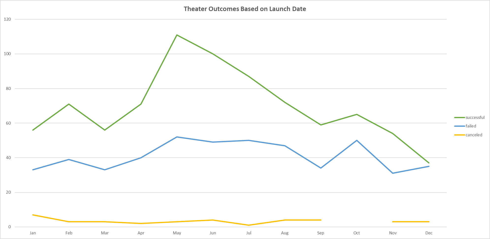
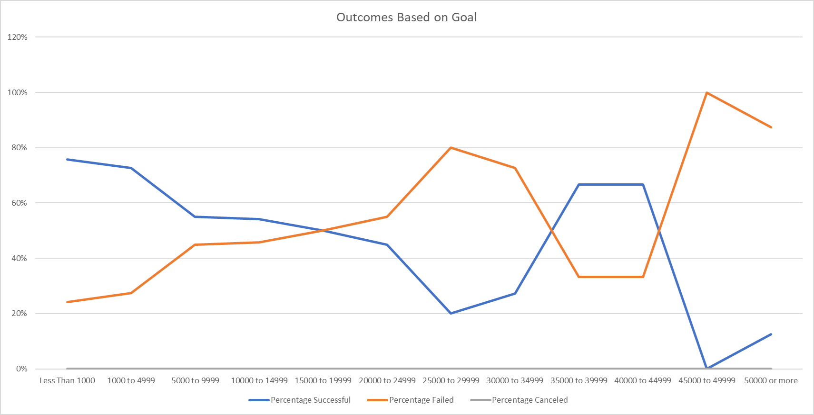

# Kickstarting with Excel

## Overview of Project

- In this project you will find
    1. Kickstarter_Challenge.xlsx
    2. Images folder containing Outcomes_Based_on_Goals.png and Theater_Outcomes_vs_Launch.png
    3. Readme.md

### Purpose

- The purpose of this analysis is to compare how Kickstarter campaigns for plays succeeded in relation to their launch dates and their funding goals to help Louise determine the best month to launch her play's campaign.

## Analysis and Challenges

### Analysis of Outcomes Based on Launch Date

- My analysis finds the best time to launch a Kickstarter campaign for aplay is beteen the months of May through July, with June being the month with the highest success.

- The worst month to launch a play campaign would be December, with January, March, September, and November also being lower months of success for plays as seen in the picture below.

### Analysis of Outcomes Based on Goals

- The success of Kickstarter plays tapers drasticly as the cost of the project increases, with a spike in success for projects in the 35,000 to 44,999 range

- Goals in the range of 45,000 to 49,999 had by far the highest rate of failure at an astounding 100%.

### Challenges and Difficulties Encountered

- Had issues with properly narrowing down the data using the "=COUNTIFS" formula, but found exact syntax needed to describe the desired outcome by adding an additional argument to count by plays.

## Results

- What are two conclusions you can draw about the Outcomes based on Launch Date?

- The month of May saw the most Kickstarter campaigns for plays, and in turn had the most successful plays, and the most failed plays in one month. The month of December had the highest rate for failure by percent of play campaigns.

- What can you conclude about the Outcomes based on Goals?

- Campaigns with low goal amounts tend to be the most successful, with an exception for goals in the range of 35,000 to 44,999.

- What are some limitations of this dataset?

- This dataset only considers plays from one crowdfunding website; there are other services that provide similar services to launch performance art that are similar to Kickstarter, such as Indie GoGo or Wefund.  The most recent dates this dataset has to offer are from 2017, more recent data would be more relavent to determin the best time to launch a Kickstarter for plays in 2022.

- What are some other possible tables and/or graphs that we could create?

- We could calculate the percentage of successful, failed, or canceled campaigns by date, like the calculations used for Outcome Based on Goal.  
